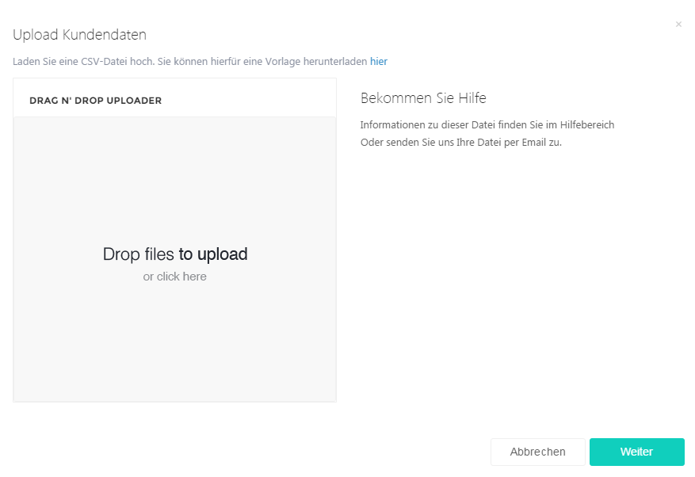
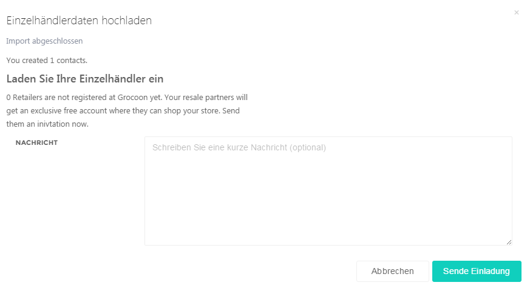

# Einzelhändler einladen

Auf Grocoon können Sie Ihre bestehenden Einzelhändler einladen, um zukünftig Grocoon als Bestellplattform bei Ihnen zu nutzen.

Gehen Sie dazu auf Grocoon -&gt; Einzelhändler und klicken Sie auf „Einzelhändler hochladen“. Folgendes Fenster öffnet sich:

Auch hier haben Sie die Möglichkeit eine Excel- oder CSV-Datei hochzuladen. Verwenden Sie dazu ganz einfach die bereitgestellte Vorlage und speichern Sie diese als Excel oder CSV ab.

| Company    | First Name | Last Name | Email          | Street | Postal Code | City      |
|------------|------------|-----------|----------------|--------|-------------|-----------|
| Fritz GmbH | Hans       | Fritz     | fritz@fritz.de |        | 6499        | Frankfurt |
| Meier      | Jürgen     | Meier     | meier@meier.de |        | 2323        | München   |

Fügen Sie Ihre Daten in die Vorlage ein und speichern sie erneut ab. Anschliessend fügen Sie die Datei per Drag N’ Drop ein und klicken auf „Weiter“.

Danach erhalten Sie die Möglichkeit eine Nachricht zu schreiben.

Klicken Sie danach auf „Sende Einladung“. Ihre Kunden erhalten danach eine Einladung für Grocoon.

Unter diese Kategorie können Sie kontrollieren, ob Ihre Einzelhändler sich bei Grocoon registriert haben.
