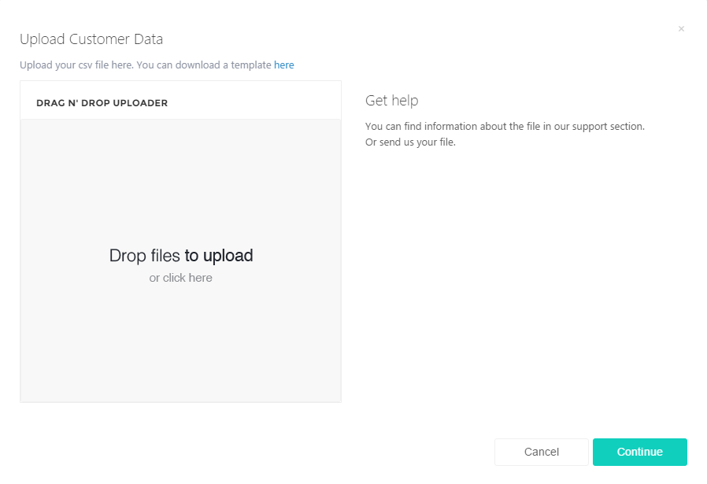
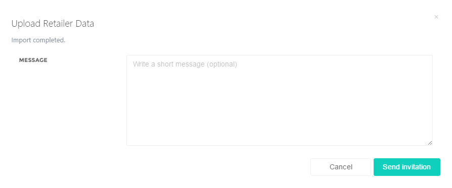

# Invite retailers

You can invite your existing retailers to use Grocoon as your order platform.

In order to do so, please go to Grocoon -&gt; Retailers and click on Upload Retailers. The following window will open:

Here you can upload an Excel or CSV file. In case you have a file in a different format, simply use the provided template and convert it into an Excel or CSV file.

| Company    | First Name | Last Name | Email          | Street | Postal Code | City      |
|------------|------------|-----------|----------------|--------|-------------|-----------|
| Fritz GmbH | Hans       | Fritz     | fritz@fritz.de |        | 6499        | Frankfurt |
| Meier      | Jürgen     | Meier     | meier@meier.de |        | 2323        | München   |

Insert your data into the template and save it. (when I wanted to access the template, I had to ask for a permission) Upload the file using Drag N’ Drop and then click next.

After that you get the opportunity to write a message.

Then click on "Send invitation". Your customers will receive an invitation to join Grocoon.

Under this category, you can control whether your retailers have registered on Grocoon.
