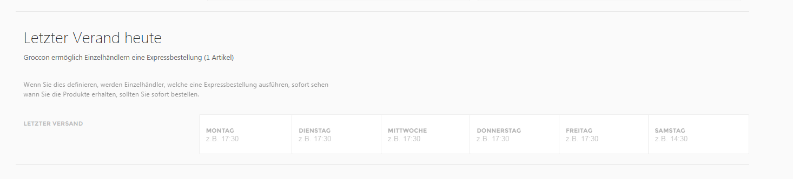
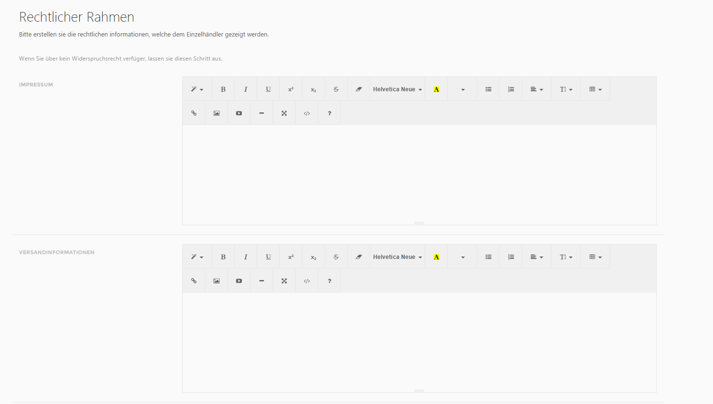
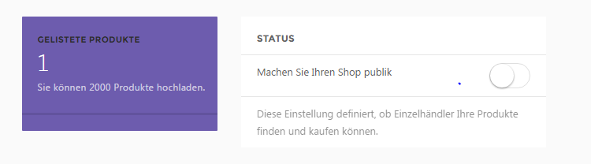

# Publikation des Shops

## 1\. Notwendige Einstellungen

Definieren Sie die Versandoptionen und den rechtlichen Rahmen unter Grocoon -&gt; Einstellungen

Hier können Sie die Uhrzeit für den letzten Postausgang am jeweiligen Wochentag definieren.

Ihr Impressum, Ihre Versandoptionen, Ihre AGBs und ein mögliches Widerrufsrecht können Sie ebenfalls auf Grocoon unter „Ihren Einstellungen“ einfügen und bearbeiten.

## 2\. Shop publik machen
Gehen Sie auf Grocoon -&gt; Abonnements und machen Sie Ihren Shop publik.

Registrierte Einzelhändler auf Grocoon können Ihre Produkte jetzt suchen und bestellen.
