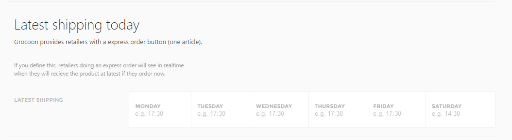
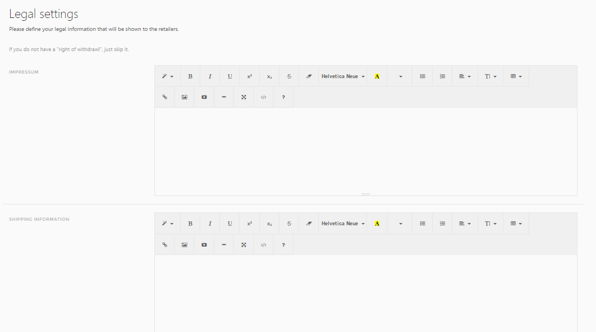
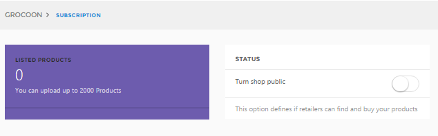

# Shop Set Up

## 1\. Settings
Define the shipping options and the legal framework under Grocoon-&gt; Settings

Here you can specify the time for the last outgoing delivery for each day of the week.

In the “Settings” section you can also paste and edit your impressum, shipping information, terms and conditions, and rights of withdrawal.

Once you have uploaded the information, click “Submit”.

## 3\. Turn your shop public
Go to Grocoon -&gt; Subscription and turn your shop public.

Registered retailers on Grocoon can now search and order your products.
